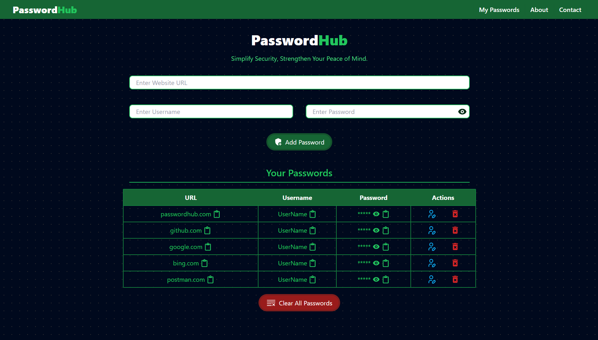
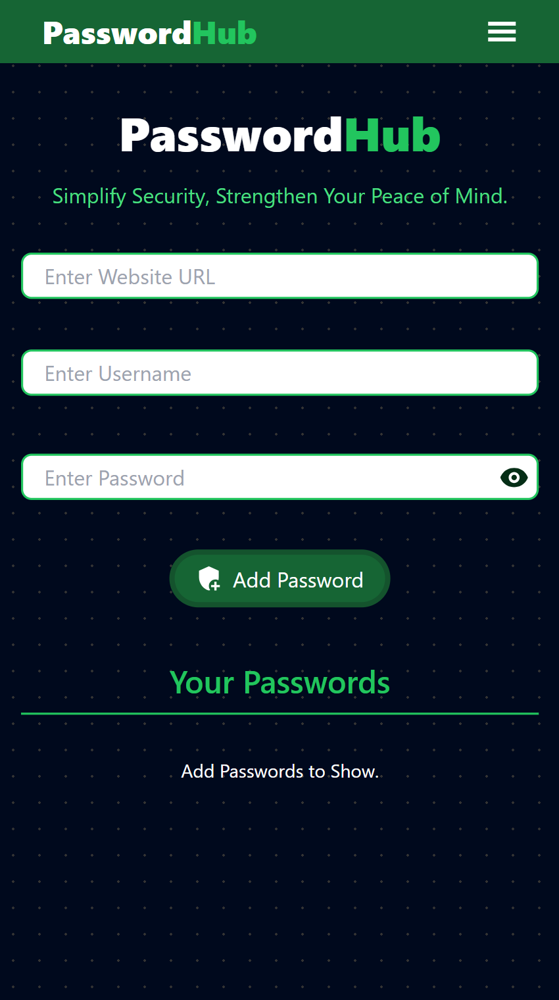

# PasswordHub

PasswordHub is a simple, intuitive, and secure password manager designed to help users organize and safeguard their credentials efficiently. Built with **React**, **Tailwind CSS**, and **Vite**, PasswordHub offers robust features such as password visibility toggling, clipboard copying, and password editing.

## Features

- **Add Passwords**: Save website URLs, usernames, and passwords securely.
- **Password Visibility Toggle**: Show or hide your passwords as needed.
- **Clipboard Copying**: Copy URLs, usernames, or passwords with a single click.
- **Edit/Delete Passwords**: Modify or remove credentials effortlessly.
- **Clear All Passwords**: Remove all saved data with one action.
- **Responsive Design**: Optimized for use on all devices.
- **Modern UI**: A sleek and minimal interface with dynamic gradient backgrounds.

## Live Demo

Access the live version of PasswordHub here:  
[PasswordHub on GitHub Pages](https://ksaiprashanth.github.io/passwordhub/)

## Technologies Used

- [React](https://react.dev) - Frontend Framework
- [Tailwind CSS](https://tailwindcss.com) - Utility-First CSS Framework
- [Vite](https://vitejs.dev) - Frontend Build Tool

## Installation

If you'd like to run the project locally:

1. Clone the repository:
   ```bash
   git clone https://github.com/ksaiprashanth/passwordhub.git
   ```

2. Navigate to the project directory:
   ```bash
   cd passwordhub
   ```

3. Install dependencies:
   ```bash
   npm install
   ```

4. Start the development server:
   ```bash
   npm run dev
   ```

5. Open the app in your browser:
   ```
   http://localhost:5173
   ```

## Usage

1. **Add Credentials**: Enter the website URL, username, and password, then click **Add Password**.
2. **Manage Passwords**:
   - View: Toggle visibility for passwords.
   - Copy: Copy individual fields to the clipboard.
   - Edit: Modify saved credentials.
   - Delete: Remove individual entries or clear all data.

## Screenshots

### PasswordHub UI

#### Desktop View


#### Mobile View


## Contributing

Contributions are welcome! To contribute:

1. Fork the repository.
2. Create a new branch for your feature or fix:
   ```bash
   git checkout -b feature-name
   ```
3. Commit your changes:
   ```bash
   git commit -m "Add feature/fix bug"
   ```
4. Push the branch:
   ```bash
   git push origin feature-name
   ```
5. Open a Pull Request.

## License

This project is licensed under the MIT License. See the [LICENSE](LICENSE) file for details.
